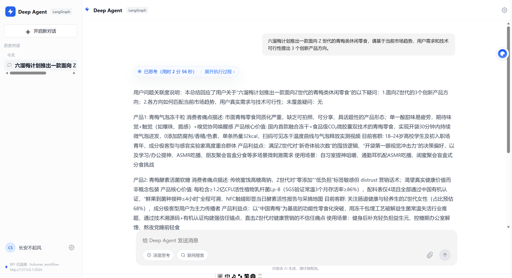
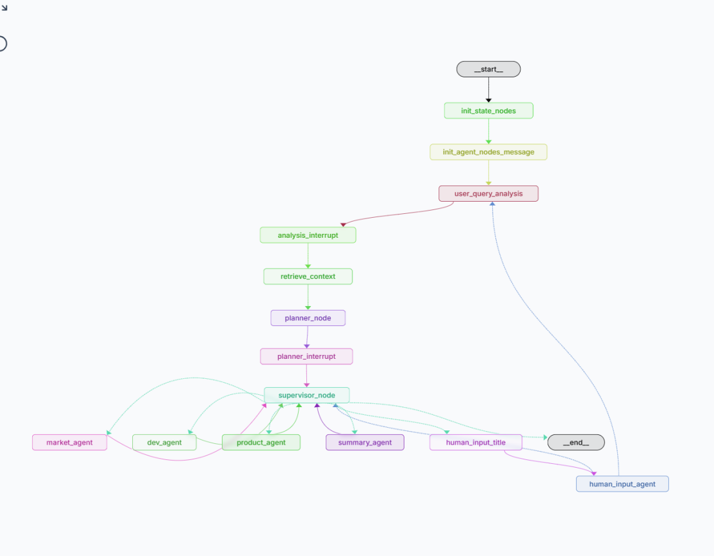

# deep-agent

我把项目结构和启动脚本都看过了，这个仓库不是“前端 + 单一后端”，而是这 3 个进程一起配合：

LangGraph 主服务，项目根目录启动
server 里的 Node BFF
frontend 里的 Vite 前端
按当前代码，正确启动顺序是：

# 终端 1：根目录
conda activate agent
python -m pip install -r requirements.txt
langgraph dev
LangGraph 默认地址是 http://127.0.0.1:2024，图 ID 是 liuliumei_workflow。这部分在 LANGGRAPH_DEV.md 和 server/src/index.js 里都对上了。

# 终端 2：BFF
cd server
npm install
npm run dev
server 默认监听 http://127.0.0.1:3001，并代理到 LangGraph 的 http://127.0.0.1:2024。如果你的 LangGraph 不在这个地址，就先设环境变量再启动：

$env:LANGGRAPH_BASE_URL="http://127.0.0.1:2024"
$env:LANGGRAPH_ASSISTANT_ID="liuliumei_workflow"
npm run dev
# 终端 3：前端
cd frontend
npm install
npm run dev
前端固定跑在 http://127.0.0.1:5180，并且 Vite 已经把 /api 代理到 http://127.0.0.1:3001，这点在 frontend/vite.config.ts 里已经写死了。

你可以把它理解成：

真正的 AI 工作流后端：langgraph dev
给前端用的业务接口层：server
页面：frontend
如果你愿意，我下一步可以直接继续帮你整理成一份“一键启动检查清单”，或者直接帮你试跑并判断现在缺什么环境。

前端页面：

智能体页面：

